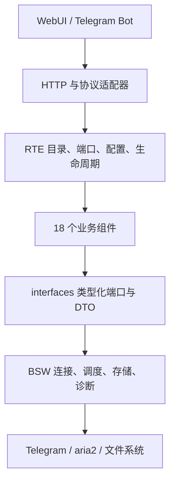

# AUTOSAR 分层与运行设计

本项目将 SWC、类型化端口、RTE 生命周期和 BSW 资源管理用于 Telegram 下载应用。它采用 AUTOSAR 的分层思想，不声称符合汽车 ECU 的标准认证、ARXML 生成或硬实时要求。

`application/catalog.go` 是组件声明入口。业务组件不导入 app、旧全局配置、其他 SWC 或数据库；`app/runtime` 只装配真实资源，`app/watch`、`app/webui` 和 `app/bot` 保留协议转换及兼容入口。依赖方向由 `internal/architecture` 的测试约束。连接与配置文件的生命周期由资源拥有者负责，不由页面访问或业务状态采样触发。

## 配置生效边界

| 变更 | 生效范围 |
| --- | --- |
| 下载模式、执行器优先级、本地目录 | 新任务使用新配置；已准备的任务保留执行器和目录快照，既有任务不迁移 |
| 并发文件数、DC 容量 | 调度器原地更新；aria2 RPC 更新文件并发；新提交使用新的 split；旧 Telegram RPC 完成后释放旧连接池 |
| 过滤、命名、表情、分组转发规则 | 校验、持久化后原子发布，不重启监听器 |
| HTTP 公网地址、TTL | 原地更新，不重启监听端口；TTL 使用现有任务滑动过期机制 |
| 本地下载和转发队列扫描/重试、aria2 监控策略 | 组件原地更新 |
| HTTP/WebUI 监听地址、aria2 连接、Telegram 连接及旧转发监听参数 | 自动重建所属服务和必要依赖；WebUI 地址变更后连接新地址 |
| 账号命名空间、存储位置、程序升级 | 需要整个进程重启 |

保存携带 revision，过期提交返回 409；不覆盖其他窗口的修改。校验失败不发布配置。配置页按 schema 标注热更新或服务重启；未启动组件也可保存。常驻策略的启停只重建依赖闭包，原有消费者通过动态端口获取当前实例。本地下载器停用不会阻止 aria2 模式启动。

配置通过受控 API 保存时热应用；直接编辑组件文件需要重新启动以获得一致的整组配置，不提供跨文件的外部编辑事务。

## 下载与控制通道

HTTP 下载服务与 aria2 不存在包依赖或生命周期依赖。aria2 是可选执行器，每次提交解析当前实例；明确未接受时才允许按执行器列表降级，RPC 超时不会导致重复提交。HTTP 字节直接进入 Range/流式传输路径，不经过 RTE 事件或 WS。

保留按 DC/文件配额、慢客户端背压、断点续传、分片重试及内容完整性机制。控制面统计按主题共享采样；多个页面不会重复触发同一批统计工作。连接池扩缩容允许当前 RPC 完成，不截断正在读取的分片。实际公网速度取决于 Telegram、网络、磁盘与 aria2；回归测试验证机制，不提供虚构的公网测速结论。

WebUI 使用 HTTP 命令 + WS 状态订阅。WS 每秒共享采样，只发送变化的主题，ping/pong 只承担连接存活检测；断线指数退避重连，并以每 5 秒 HTTP 快照兜底。会话撤销关闭已建立的 WS，拒绝跨源升级。下载器模式和配置版本通过 status 推送，其他窗口无需刷新即可同步。

## 页面与分组转发

仪表盘、下载管理、转发监控、系统设置各自声明配置范围。两个标签采用 160ms 淡入/位移动画，支持键盘操作和减少动态效果偏好；切换保留未保存草稿，信息订阅在配置标签打开时暂停。高级组件页保留完整 schema 和诊断入口。

转发规则使用可搜索的“来源 / 目标”双列选择器，含群组、频道、用户、机器人和归档聊天；目标额外提供收藏夹。列表为当前账号已有且可访问的会话，不是 Telegram 全网用户搜索。规则支持启停、复制、排序和独立模式/静默设置。

交互参考 [n8n Switch 的多匹配输出](https://docs.n8n.io/integrations/builtin/core-nodes/n8n-nodes-base.switch/)：执行所有匹配规则，对重复目标采用靠前规则的参数并去重。每个目标独立入队，单个目标失败不阻止其他目标；稳定任务标识防止相册重复更新或部分入队重试再次创建任务。已入队任务保留当时规则快照；规则更新只影响随后处理的消息。

来源和目标使用 `user:ID`、`chat:ID`、`channel:ID`，避免不同类型相同数字 ID 冲突。保存前拒绝自转发和配置环路。匹配显式规则的来源不再走旧版默认目标；没有匹配规则的来源保留旧监听行为。表情触发继续使用默认目标。需要启用 `trigger.forward`，账号需要访问来源并向目标发送消息的权限。传输语义遵循 [Telegram messages.forwardMessages](https://core.telegram.org/method/messages.forwardMessages)。

稳定入队身份不等于网络上的严格 exactly-once：进程在 Telegram 接受发送后、记录成功前退出，仍可能在恢复重试时再次发送。当前去重范围是保留中的队列记录；清理历史后不承诺永久去重。

验证与真实环境限制见 [验收清单](migration-status.md)。
