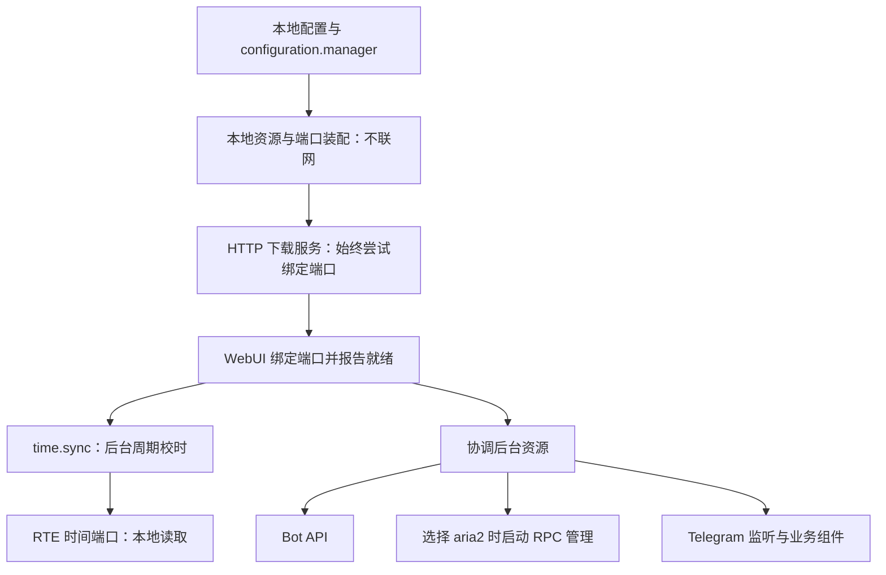

# 启动顺序与网络故障隔离

业务组件目录由 `application/catalog.go` 统一声明，共 20 个组件。启动入口在 `cmd/root.go`，生产资源装配在 `app/runtime`，依赖排序和生命周期由 `rte` 管理。

## 启动阶段

1. 读取并校验本地 `tdl_config.json`，初始化日志和本地数据库，启动 `configuration.manager`。
2. 冻结业务配置，装配本地规则、账号资源所有者和任务控制端口。这些构造及 Start 方法不连接 Telegram、Bot API、aria2，也不探测 NTP。账号资源所有者此时仅持有连接生命周期，不代表已经联网或登录。
3. 启动必需的 HTTP 下载服务，再启动 `panel.webui`。二者绑定 TCP 监听器并装配路由成功后才报告就绪；HTTP 监听失败会记录地址和错误，不阻止 WebUI 启动。配置解析失败也写入日志文件。
4. 通过生产依赖图启动独立的 `time.sync` SWC、Bot、所选下载器的管理服务和 Telegram 监听。只有选择 aria2 且启用对应组件时才启动 aria2 管理；本地和仅链接模式不启动它。时间同步组件发布 `time.clock` 端口，并由 RTE 周期任务在后台校时；同步成功不作为其他后台模块的启动前置条件。
5. Telegram 监听直接进入其认证和重连循环，启动钩子不再先执行在线会话检查。网络失败由其进程、控制器及 RTE 诊断记录，不撤销 WebUI；NTP 首次同步失败时使用系统时间，后续失败时保留上次成功的偏移并继续重试。

WebUI 的业务操作仍可能依赖网络，例如 Telegram 登录、更新检查和 aria2 操作；这些请求的失败与本地面板的监听、身份验证、配置和日志功能分开处理。`panel` 对本地账号所有者的生命周期依赖用于确保登录请求排空后才释放共享资源，不表示等待 Telegram 在线。

## 全部业务组件

| 组件 | 装配位置 / 生命周期 | 外部网络依赖 |
| --- | --- | --- |
| `configuration.manager` | 进程启动时，本地统一配置服务 | 无 |
| `panel.webui` | 网络初始化前启动，本地 HTTP 管理入口 | 监听和本地管理功能无外网依赖 |
| `time.sync` | WebUI 就绪后启动，独立进程作用域宿主 | 周期任务访问 NTP；时间端口读取无网络依赖 |
| `account.telegram` | 本地策略宿主；账号连接由 `host.account` 所有、按需建立 | 凭据配置不联网；会话检查、登录及消息操作使用 Telegram |
| `filter.rules` | 本地策略宿主，下载过滤 | 无 |
| `naming.rules` | 本地策略宿主，文件和目录命名 | 无 |
| `forward.rules` | 本地策略宿主，转发规则 | 无 |
| `trigger.reaction` | 本地策略宿主，反应匹配和去重 | 匹配本身不联网；事件来源为 Telegram |
| `trigger.messagelink` | 本地策略宿主，消息链接校验和提交端口 | 校验不联网；执行依赖下载业务资源 |
| `update.self` | 本地策略宿主，按用户操作检查和下载更新 | 更新请求才访问远端 |
| `download.control` | `host.downloads`，任务路由和控制端口 | 装配不联网；提交依赖所选执行器 |
| `console.bot` | `host.bot`，机器人身份验证后装配 | Bot API |
| `notify.telegram` | Bot 宿主，通知端口 | Bot API |
| `storage.maintenance` | Bot 运行时装配的数据维护服务 | 清理本身只访问本地数据库；Bot 命令入口依赖 Bot API |
| `downloader.aria2` | 选择 aria2 时启动独立进程及组件宿主 | aria2 RPC，按现有策略重连；提交新任务不依赖管理进程处于运行状态 |
| `proxy.range` | 随程序启动，独立 HTTP 控制器及组件宿主 | 监听不要求 Telegram 或 aria2 在线；远端文件读取才需要 Telegram，完整本地文件可直接读取 |
| `downloader.local` | Telegram 连接作用域内装配下载 worker | Telegram 与本地文件系统 |
| `forwarder` | Telegram 连接作用域内装配转发 worker | Telegram |
| `trigger.download` | Telegram 监听连接内装配下载意图处理 | Telegram 事件及下载执行器 |
| `trigger.forward` | Telegram 监听连接内装配转发意图处理 | Telegram 事件及转发执行器 |

## NTP 与配置一致性

NTP 由 `time.sync` 集中管理，默认每 300 秒同步，可设为 60 秒。优先尝试配置地址，最多三次、默认每次三秒；失败或未配置时并发探测内置候选。首次成功之前使用系统时间，成功后通过原子快照更新偏移，后续失败保留该偏移并在下一周期重试。设置、端口及状态字段见 [时间同步 SWC](time.md)。

所有组件宿主通过 RTE 注入同一个时间端口。Telegram 客户端适配器、命名规则和面板时间读取已使用该端口；已有消费者会看到后续同步结果，无需重建连接。客户端构造不再查询 NTP，避免在账号共享锁内进行 DNS/UDP 等待。校时结果属于运行状态，不写回配置文件，也不重载业务设置。旧 `account.telegram.ntp` 在加载时迁移到 `time.sync.server`，下次显式保存时写入新结构；用户在同步期间保存的设置仍需重启生效。

进程取消会中断 NTP 探测并排空已启动资源。端口占用、监听地址无效、面板被显式停用、配置损坏或本地存储无法打开，仍可能阻止 WebUI 启动；外网不可达不再是启动面板的前置条件。

## 退出流程

主程序统一接收 Ctrl+C 和 `SIGTERM`。Windows 控制台右上角关闭按钮产生的关闭事件由 Go 转成 `SIGTERM`，同样触发完整退出；Telegram 监听只接收所属运行上下文的取消，不再独立处理系统信号。

退出时先通知后台任务停止。监听保存本地下载的暂停状态，并等待保存操作和下载、转发工作退出；运行时按依赖顺序释放各服务和共享账号资源，最后关闭数据库与日志。控制台显示“正在停止 TDL”，单个模块停止超过一秒时提示正在等待哪个模块，全部收尾成功后显示“TDL 已停止”。模块停止的耗时和失败原因写入日志，原有每模块 10 秒停止超时保持不变。

Windows 直接关闭控制台仍受系统关闭时限约束，慢网络请求或大量待保存任务可能延长收尾；不通过提前关闭数据库或跳过任务保存来缩短退出时间。

## SWC 阻塞检查

检查覆盖全部 20 个业务组件及其宿主、RTE 生命周期、端口查询和管理请求。已修复的传播路径如下：

| 原阻塞点 | 影响 | 当前处理 |
| --- | --- | --- |
| NTP 探测在启动主流程内同步等待 | HTTP 等独立后台服务也等待 NTP | 独立 SWC 周期任务执行，退出时取消并排空，健康页可观察 |
| Telegram 客户端构造再次查询 NTP | 账号共享锁被网络占用，其他账号操作被串行阻塞 | 从 RTE 读取共享校时时钟，构造仅创建本地对象 |
| 监听启动前在线检查会话 | 持有生命周期转换锁等待网络；失败后不进入重连循环 | 直接启动已有的认证与重连任务 |
| 配置、状态和端口查询使用生命周期锁 | 慢 Start、Stop、配置准备或任务排空拖住管理读取，甚至与退出中的端口调用互相等待 | 从不可变快照读取状态、配置及所属实例的端口；未运行组件拒绝解析端口 |
| 会话列表缓存持锁请求 Telegram | 后续请求即使超时或取消也要等待首个请求 | 网络调用在锁外运行；共享刷新结果，等待者可单独取消 |

其余组件的外网工作在各自任务或显式业务请求内执行。下载与转发队列、通知、登录、更新和数据维护的生命周期、取消及排空路径也纳入检查。依赖排序、本地配置/数据库读写和资源释放仍有必要的同步步骤；生命周期钩子必须及时返回，耗时网络工作必须受所属任务和 context 管理。读取快照不代表网络操作已经完成，也不会强行释放尚未排空的资源。

## 回归验证

- `main_windows_test.go`：使用临时配置与隐藏的独立控制台，通过真实窗口关闭事件和 Ctrl+C 验证主程序正常退出；覆盖有、无 Telegram 监听，检查任务暂停状态、进度保留和数据库句柄释放。
- `cmd/startup_test.go`：实际命令入口和 HTTP 请求，覆盖网络初始化挂起、失败、成功及取消；验证面板、配置、日志、诊断及独立 HTTP 下载代理可用，以及探测期间保存的设置不提前生效。
- `app/runtime/startup_test.go`：验证端口占用和真实监听就绪、监听无需在线预检即可启动，以及生产依赖图中 Bot、aria2、监听和下载代理启动失败时 WebUI 继续提供服务。
- `application/time.sync/service_test.go`：周期同步、不重叠、故障保持、恢复、取消和服务器选择。
- `bsw/ecual/ntp/client_test.go`：UDP 探测超时与取消。
- `internal/configuration/time_migration_test.go`：旧字段迁移、显式配置优先和只读加载边界。
- `internal/core/tclient/clock_test.go`、`rte/clock_test.go`：消费者共享实时更新的时间端口，构造不访问 NTP，定时器不受偏移影响。
- `application/naming.rules/clock_test.go`：命名日期和模板 `now` 使用 RTE 时钟。
- `rte/diagnostics_test.go`：阻塞 Start、Stop、PrepareConfig 时仍可读取配置、状态与端口；配置提交前后读取对应快照。
- `application/account.telegram/dialogs_test.go`：刷新合并、缓存复制隔离、等待请求取消与刷新失败后重试。

这里采用 AUTOSAR 的显式生命周期依赖、就绪状态和故障恢复思想。[AUTOSAR Execution Management 规范](https://www.autosar.org/fileadmin/standards/R22-11/AP/AUTOSAR_SWS_ExecutionManagement.pdf)描述了这些机制；本项目的分层设计不等同于完整 AUTOSAR 规范符合性认证。
